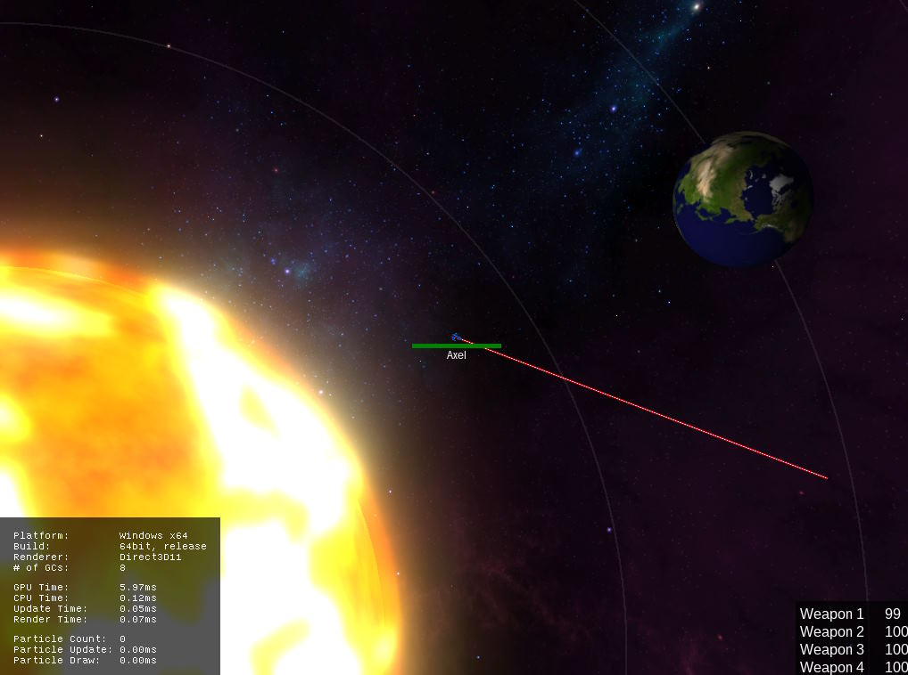
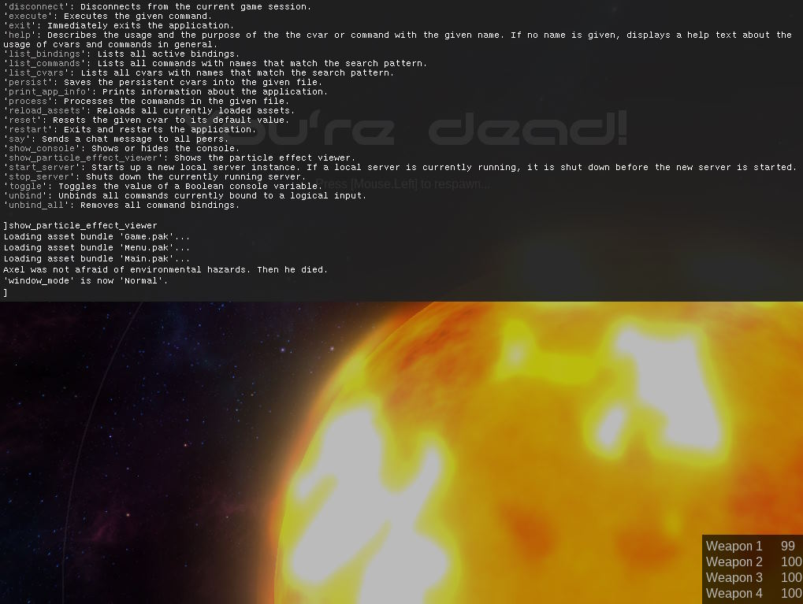
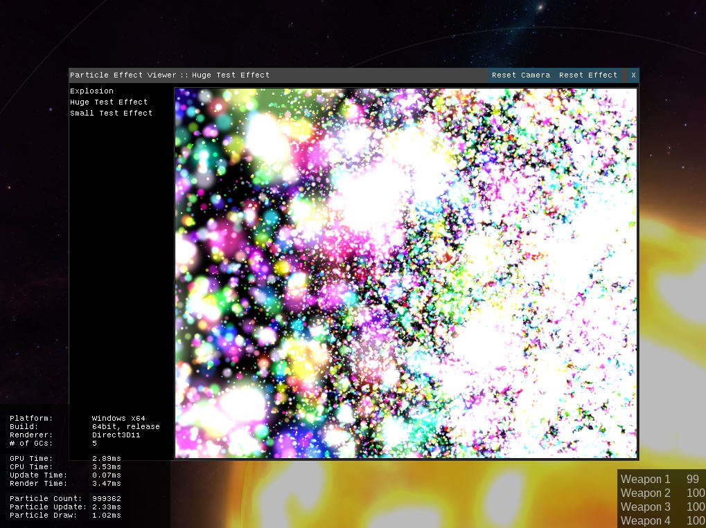
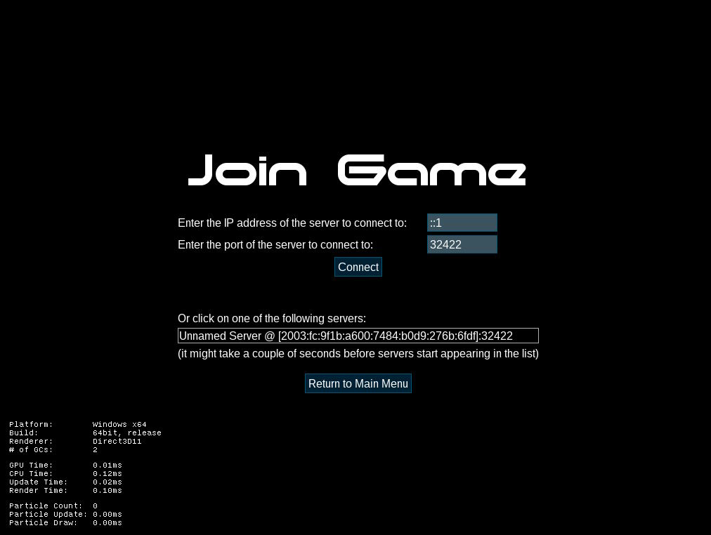

# lwar

lwar is a 2.5D multiplayer space shooting game; but first and foremost, it's a learning project.

It thus avoids the use of libraries except for SDL2 and some asset compilation tools.
Everything is implemented by hand to maximize the learning experience.
There is a lot of infrastructure code that is not at all necessary for this kind of small game.
But when it was interesting to implement it anyway, it was indeed implemented.

Some notable learning highlights that are completely over the top:

- The network protocol is custom-built using only UDP, supporting both reliable and unreliable messaging. See also its [specification](/Documentation/network.txt).
- There is a C# to HLSL/GLSL cross compiler to avoid having to write each shader twice.
- For the game's UI, a partial reimplementation of .NET's WPF framework is used, including a custom XAML compiler.
  The game's UI can be visually designed using Visual Studio's WPF designer; its design time and runtime appearance are nearly identical.
- The game features a highly optimized CPU-based particle system written in C# that can animate millions of particles per second.

lwar's game client, 3D rendering, shaders, and the asset compilation pipeline are written C#, C++, .NET IL byte code, OpenGL 3, and Direct3D 11. The server is implemented in C, with an additional C# version.

The game can be compiled for Windows using Visual Studio 2015 and also runs on Linux using Mono.

## Screenshots

_In-game screenshot showing the player's ship shooting a laser in sun's orbit with Earth nearby._

_Screenshot of the in-game console, listing available commands, with the sun in the background._

_In-game particle viewer rendering almost 1 million particles in roughly 3ms of CPU and GPU time on a Ryzen 7 5800X and a GeForce 1060._

_Screenshot of the in-game Join menu rendered with a partial reimplementation of WPF. It is quite obvious that the goal was to learn how WPF works, and not to implement a good looking UI itself._
